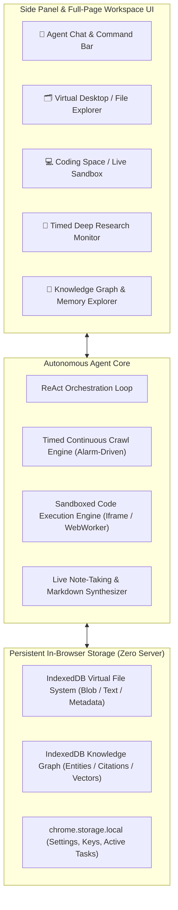
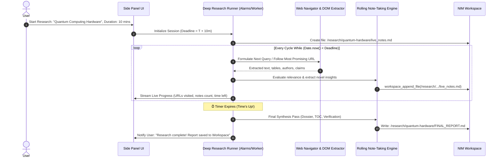
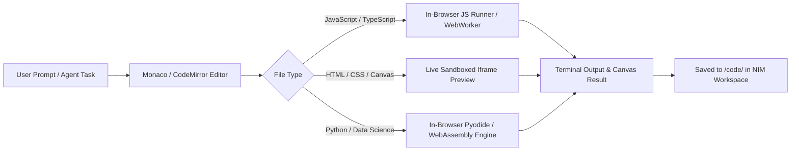

# NIM Agent v2.0: Architectural Blueprint & Master Plan

## Executive Vision

NIM Agent is evolving from a browser automation extension into a **full-fledged In-Browser Autonomous Operating System**. The agent is not just an ephemeral chatbot; it has its own **Virtual Desktop & File System**, a **Sandboxed Coding Space**, and an **Unstoppable Timed Deep Research Engine** that continuously scours the web, gathers intelligence, and synthesizes living documents directly in its virtual drive until the user's timer expires.

All features run **100% browser-native** (Manifest V3 compatible, IndexedDB persistent, zero external servers or Python runtimes required).

---

## Architecture Overview



---

## 🗂️ Deep Dive 1: NIM Virtual Workspace ("The Agent's Virtual Desktop")

Like a physical computer desktop, NIM Agent has its own dedicated in-browser filesystem where both the user and the agent can create, edit, organize, link, and export files.

### 1.1 Virtual File System (VFS) Architecture
- **Engine**: IndexedDB (using native IndexedDB transaction store with sub-millisecond retrieval).
- **Quota**: Up to browser storage quota (typically 10GB+), completely private and client-side.
- **Hierarchy**:
  ```text
  /workspace/
  ├── /notes/               # Quick notes, scratch thoughts, meeting notes
  ├── /research/            # Timed deep research outputs, dossiers, source citations
  │   └── /2026-10-ai-models/
  │       ├── research_raw_notes.md
  │       ├── sources_catalog.json
  │       └── executive_report.md
  ├── /code/                # Scripts, projects, web demos
  │   └── /scraper-bot/
  │       ├── script.js
  │       └── output.json
  ├── /data/                # CSV tables, extracted datasets, JSON schemas
  └── /trash/               # Soft-deleted items with 30-day auto-purge
  ```

### 1.2 File Metadata Model
```typescript
export interface VFSFile {
  id: string;               // UUID
  path: string;             // e.g. "/research/quantum-computing/summary.md"
  name: string;             // "summary.md"
  extension: string;        // "md", "json", "js", "py", "csv", "html", "txt"
  mimeType: string;
  sizeBytes: number;
  content: string;          // UTF-8 string content or Base64 for binary
  createdAt: number;
  updatedAt: number;
  createdBy: 'user' | 'agent' | 'system';
  tags: string[];
  pinned?: boolean;
  metadata?: {
    sourceUrls?: string[];
    taskOriginId?: string;
    wordCount?: number;
    summary?: string;
  };
}
```

### 1.3 Agent Tools for Workspace Manipulation
The agent is given first-class tools to operate in its workspace during any autonomous task:

| Tool Name | Parameters | Purpose |
|---|---|---|
| `workspace_create_file` | `path`, `content`, `tags`, `overwrite` | Create a new file or document in workspace |
| `workspace_append_file` | `path`, `text` | Append streaming findings or notes without overwriting |
| `workspace_read_file` | `path` | Read file contents into agent context |
| `workspace_list_files` | `directory`, `tagFilter`, `searchQuery` | List files and folders with metadata |
| `workspace_delete_file` | `path`, `moveToTrash` | Delete or move to trash |
| `workspace_export_zip` | `folderPath`, `downloadName` | Package files as `.zip` and trigger browser download |
| `workspace_find_in_files`| `keyword`, `regex` | Full-text search across all workspace files |

### 1.4 Virtual Desktop UI Features
1. **Split-Screen & Tabbed Windows**: Side-by-side view (Chat on left, File Explorer/Editor on right, or toggleable fullscreen mode).
2. **Multi-Format Previewer**:
   - **Markdown (`.md`)**: Rendered with GitHub-flavored markdown, syntax highlighting, LaTeX math, and clickable citation links.
   - **Tabular Data (`.csv`, `.json`)**: Interactive data grid with sorting, search, filtering, and "Export to Excel/CSV" button.
   - **HTML / Canvas (`.html`)**: Live sandboxed iframe preview with hot reload.
3. **Desktop Controls**: Drag-and-drop file upload (user can drop PDFs/text into the agent's desk), multi-file selection, rename, tag manager, and storage meter.

---

## 🔬 Deep Dive 2: Timed Deep Research Engine ("Unstoppable Web Crawler")

> **User Requirement**: *"The research won't stop until the time which was given ends... like 10 min or 2 min, and it continues the research and notes simultaneously till time's up."*

### 2.1 The Timed Research Cycle

Unlike single-turn search tools that perform 1 query and quit, the **Timed Deep Research Engine** runs an autonomous exploration and synthesis loop until the exact expiration deadline (`deadline = Date.now() + durationMs`).



### 2.2 Deep Research Strategy & Self-Steering Loop
1. **Query Formulation & Expansion**:
   - Decomposes the user's objective into a tree of sub-questions: *Foundational Concepts*, *Recent Breakthroughs (2025–2026)*, *Market Leaders*, *Technical Bottlenecks*, *Future Projections*.
2. **Multi-Hop Crawling & URL Queue**:
   - Maintains an in-memory priority queue of URLs scored by relevance and source reputation.
   - Visits documentation, arXiv abstracts, tech journalism, official company roadmaps, and Wikipedia.
   - Avoids low-information loops, paywalls, and duplicate domains.
3. **Simultaneous Real-Time Note-Taking**:
   - Every relevant finding is written to `/research/[topic]/live_notes.md` with timestamps and direct source links immediately.
   - If the user pauses or stops early, not a single piece of collected data is lost.
4. **Resilience & Manifest V3 Alarms**:
   - Uses `chrome.alarms` heartbeat (e.g. every 1 minute) combined with background worker keep-alive so the crawl survives background worker restarts without dropping session state.
5. **Final Comprehensive Synthesis**:
   - Once the timer expires, the agent executes an aggregation prompt on all collected notes, generating:
     - **Executive Summary** (Key takeaways for decision-makers)
     - **Comparative Matrix** (Table comparing approaches, specs, or prices)
     - **In-Depth Sectional Breakdown**
     - **Full Citation Index** with verified URLs.

---

## 💻 Deep Dive 3: NIM Coding Space & In-Browser Execution

A complete developer environment built right into the extension side panel.



### 3.1 Components of the Coding Space
1. **Code Editor**:
   - Lightweight editor with syntax highlighting for JS, TS, Python, HTML, CSS, JSON, SQL, and Markdown.
   - Code completion, linting, line numbers, and dark theme.
2. **Execution Environments**:
   - **Browser JavaScript Sandbox**: Executes scripts safely in an isolated Web Worker with captured `console.log`, `console.error`, and return values.
   - **Web App / UI Preview Tab**: Renders HTML/CSS/Tailwind/React snippets in a sandboxed `<iframe>` with instant live reload.
   - **Python in Browser (Pyodide)**: Optional WebAssembly-based Python runtime for running scripts directly in Chrome with zero local install!
3. **Agent Coding Tools**:
   - `code_run_javascript`: Runs code and reports stdout/stderr back to the agent for self-debugging.
   - `code_generate_snippet`: Agent generates complete, tested script files directly into the workspace.
   - `code_review_file`: Agent scans an existing file in the workspace for bugs, security vulnerabilities, and optimizations.

---

## 🚀 Deep Dive 4: Cool, Advanced & Amazing Additions

### 4.1 Knowledge Graph & Semantic Memory ("NIM Brain")
- **Persistent Knowledge Graph**: Every research session and web crawl extracts entities (Companies, People, Technologies, Products, Concepts) and connects them via relationships.
- **Graph Visualizer**: An interactive force-directed graph in the side panel where users can explore everything NIM Agent has learned about the web.
- **Cross-Session Retrieval**: Ask: *"What was that API documentation we researched last week?"* — the agent retrieves the exact entity and workspace note instantly.

### 4.2 Multi-Agent Swarm / Parallel Web Squad
- **Parallel Workers**: For high-volume research, the agent can spawn up to 4 lightweight background tabs simultaneously.
- **Task Specialization**:
  - *Worker 1*: Crawls official pricing pages.
  - *Worker 2*: Searches forum reviews and reddit discussions.
  - *Worker 3*: Analyzes technical whitepapers.
  - *Lead Agent*: Gathers findings into the workspace live notes.

### 4.3 Autonomous Web Watcher & Recipe Scheduler
- Beyond passive monitoring, users can schedule autonomous agent routines:
  - *"Every morning at 8:00 AM, scrape the top 5 AI articles on Hacker News, summarize them, and save a morning digest to `/notes/daily-digest-[date].md`."*
  - *"Check my travel flight prices every 4 hours. If it drops under $400, send a browser notification and save the booking link to `/workspace/flights.json`."*

### 4.4 Voice Interaction & Audio Executive Briefing
- **Voice-to-Task**: Speak directly to NIM Agent using browser-native SpeechRecognition (`webkitSpeechRecognition`).
- **Audio Briefing**: One-click "Read Summary to Me" using `speechSynthesis` with natural voice inflection.

---

## 📅 Phased Implementation Plan

| Milestone | Target Version | Key Deliverables |
|---|---|---|
| **Phase 1: NIM Workspace Foundation** | **v1.4.0** | • IndexedDB VFS store (`src/lib/workspace/vfs.ts`)<br>• Agent workspace tools (`create`, `read`, `append`, `list`, `delete`, `export`)<br>• `WorkspacePanel.tsx` with folder explorer, markdown viewer, file upload/export |
| **Phase 2: Timed Deep Research Engine** | **v1.5.0** | • `src/lib/agent/deep-research.ts` timed crawl loop<br>• Real-time note streaming into `/research/[topic]/`<br>• Interactive countdown timer and live URL traversal UI in `ResearchPanel.tsx`<br>• Auto-synthesis of executive markdown dossier |
| **Phase 3: NIM Coding Space** | **v1.6.0** | • Code editor tab with syntax highlighting<br>• Sandboxed JS runner & HTML live preview iframe<br>• Agent code generation, testing, and debugging loop |
| **Phase 4: Knowledge Graph & Scheduler** | **v1.7.0** | • IndexedDB entity graph (`/lib/memory/graph.ts`)<br>• Background task scheduler via `chrome.alarms`<br>• Export all workspace files to GitHub / ZIP |
| **Phase 5: Parallel Swarm & Voice** | **v2.0.0** | • Multi-tab concurrent research swarm<br>• In-browser voice command and audio playback |

---

> [!TIP]
> **Execution Strategy**: We will implement **Phase 1 (NIM Workspace)** first to establish the persistent virtual file system and UI, followed immediately by **Phase 2 (Timed Deep Research Mode)** which writes directly into that workspace.
